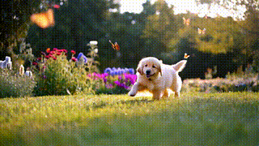

# MiniMax Python SDK

<div align="center">
    
    
[](https://pypi.org/project/minimax-python)
[](https://opensource.org/licenses/MIT)
</div>

A type-safe Python SDK for the MiniMax REST API, focusing on video generation capabilities. Built with modern Python features and focused on developer experience, this library provides a clean interface to MiniMax's video generation API.

> **Disclaimer:** This SDK is an unofficial implementation and is not affiliated with, endorsed by, or associated with MiniMax Open Platform or NanoNoble PTE. LTD.

## Installation

Requires Python 3.8 or later.

```bash
pip install minimax-python
```

## Quick Start

```python
from minimax import Minimax

# Initialize client with env variables (MINIMAX_API_KEY, MINIMAX_GROUP_ID)
client = Minimax()

# Generate a video from text
client.generate_video(
    text="A majestic dragon soars through sunset-lit clouds",
    download_path="dragon.mp4"
)
```

## Example Outputs

Here are some examples generated using this SDK:

<div align="center">

| Text-to-Video | Image-to-Video |
|:-------------:|:--------------:|
|  |  |
|  |  |

</div>

> **Note:** The examples above are compressed GIFs for preview. For the actual high-quality video outputs (720p, 25fps) generated by this SDK, check the [assets/videos](assets/videos) directory. Source images for the image-to-video examples are available in [assets/images](assets/images).

## About MiniMax Platform

[MiniMax](https://www.minimaxi.com/en) offers a comprehensive AI platform with multiple capabilities:
- 🎥 Video Generation (currently supported in this SDK)
- 🗣️ Text Generation
- 🔊 Speech Synthesis (Text-to-Audio)
- 🎙️ Voice Cloning
- And more...

This SDK currently focuses on the Video Generation API, which supports:
- Text-to-Video generation
- Image-to-Video generation
- High-definition output (720p resolution at 25fps)
- Advanced prompt control

> **Note:** While MiniMax offers many AI capabilities, this SDK currently specializes in video generation. Future versions may include support for other MiniMax APIs. You'll need a MiniMax API key and Group ID to use this SDK. Visit the [MiniMax Platform](https://www.minimaxi.com/en) to obtain your credentials.

## Features

✨ **Modern Python SDK**
- Async and sync clients with identical APIs
- Type-safe with Pydantic models
- Comprehensive docstrings and type hints

🚀 **Production Ready**
- Robust error handling with detailed messages
- Automatic retries with exponential backoff
- Progress tracking for long-running operations

🔧 **Developer Experience**
- Environment variables or constructor configuration
- Support for files, URLs, and raw bytes as input
- Rich examples for every feature

## Detailed Usage

### Synchronous Client Example
```python
from minimax import Minimax

# Initialize the client
client = Minimax(
    api_key="your_api_key",    # Optional if MINIMAX_API_KEY env var is set
    group_id="your_group_id"   # Optional if MINIMAX_GROUP_ID env var is set
)

# Example: Image-to-Video with prompt guidance
prompt = """The dragon in the image awakens, its eyes glowing with ancient power.
The camera circles slowly around as the dragon unfurls its wings, sending ripples
through the misty mountain air. Particles of golden light dance around its scales
as it raises its head majestically, creating an awe-inspiring atmosphere with
rich, vibrant colors and dramatic lighting."""

# Generate video from image
client.generate_video(
    image="dragon.jpg",
    text=prompt,
    download_path="dragon.mp4"
)
```

### Asynchronous Client Example
```python
from minimax import AsyncMinimax
import asyncio

async def main():
    # Initialize the async client
    client = AsyncMinimax(
        api_key="your_api_key",    # Optional if MINIMAX_API_KEY env var is set
        group_id="your_group_id"   # Optional if MINIMAX_GROUP_ID env var is set
    )

    # Example: Text-to-Video generation
    prompt = """A martial artist performs a spinning kick in a traditional dojo.
    The camera tracks smoothly around the movement as cherry blossom petals
    drift through the air. Time slows dramatically during the apex of the spin,
    capturing the precise form and power of the technique. The scene has a
    cinematic quality with dynamic lighting that emphasizes the flow of movement."""

    await client.generate_video(text=prompt, download_path="martial_arts.mp4")

asyncio.run(main())
```

> **Note:** Both sync and async clients support all features (text-to-video and image-to-video generation). The examples above just showcase different use cases for variety.

## Documentation

- [Examples Directory](examples/): More code examples for all features
- [API Documentation](https://platform.minimax.chat/docs/api-reference/video-generation): MiniMax's official API reference
